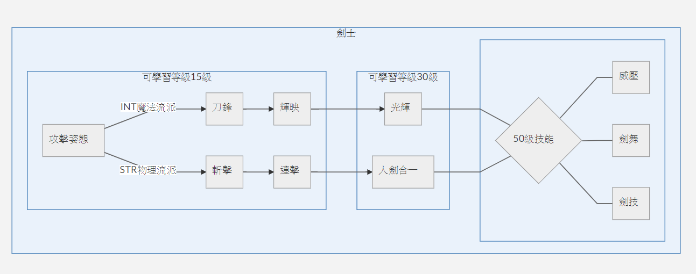

# 劍士

**攻擊姿態**

> 最高技能等級: 10 主動技能 賦予自身 力量、智力 `4 + 4/等` 點 &7持續 `30 + 5/等` 秒 \[可以疊加\]

**斬擊**

> 最高技能等級: 20 主動技能 對前方敵人連續造成 2 次 `10 + 10/等` 物理傷害

**連擊**

> 最高技能等級: 10 每次造成傷害有 `5 + 2.5/等` % 額外造成一次 `10 + 2.5/等` 無屬性傷害

**刀鋒**

> 最高技能等級: 20 主動技能 對前方一名敵人造成 1 次 `6 + 6/等` &7魔法傷害 
>
> SLv.10 每當擊殺敵人冷卻時間刷新 `3.5` 秒

